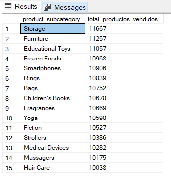
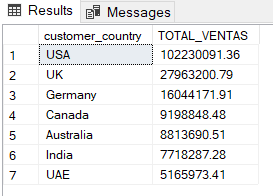
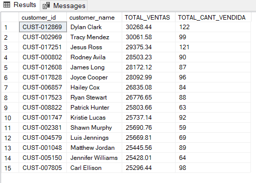
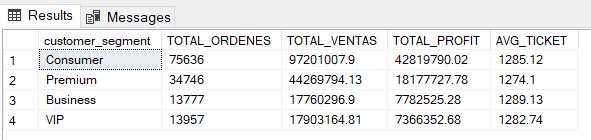
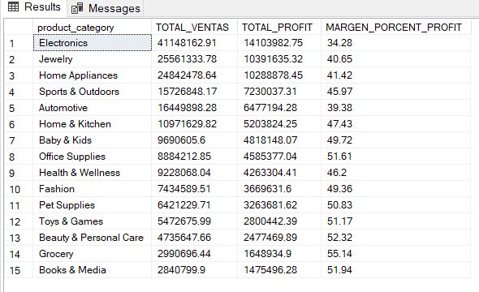
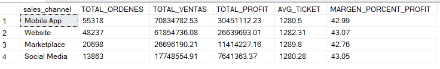
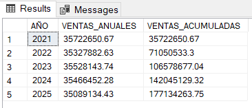
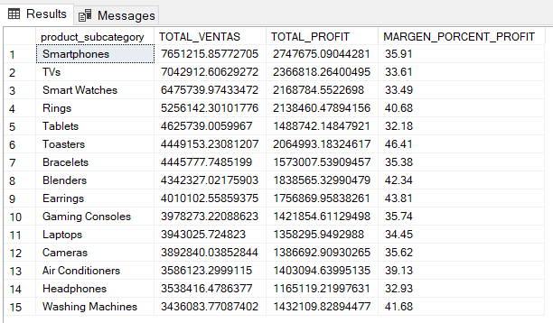
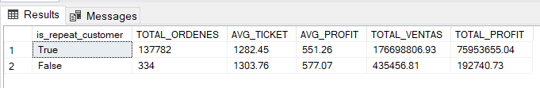

# PROYECTO_SQL ANALISIS OPERACIONES TIENDA E-COMMERCE
En el presente proyecto vamos a analizar como es el comportamiento de las operaciones en una tienda online con 10 preguntas clave, para ello estamos tomando como base referencia la siguiente data set de kaggel [enlace link](https://www.kaggle.com/datasets/datascikhan/e-commerce-sales-and-customer-analytics?select=customer_master.csv)

## ESTRUCTURA DE LAS TABLAS

Para analizar las operaciones de que nos bridan la dataset vamos a trabajar con las siguientes tablas:

- **customer_master** : contiene la información demográfica y geográfica de los clientes. Actúa como una dimensión de clientes que permite segmentar y analizar el comportamiento de compra según características como edad, género, segmento de cliente, ubicación y costo de adquisición.

- **ecommerce_sales_customer** : es la tabla de hechos que contiene el detalle de las transacciones de venta a nivel de pedido, combinando información comercial, logística, financiera y de clientes.

- **order_items** : contiene el detalle de los productos vendidos en cada pedido. Permite analizar el desempeño de productos, categorías, cantidades vendidas y rentabilidad.

- **product_catalog** : Contiene información descriptiva de cada producto, como categoría, subcategoría, marca y proveedor, permitiendo clasificar y segmentar las ventas obtenidas en las transacciones.

### INSIGHT (PREGUNTAS CLAVE)

1. **¿QUE CATEGORIAS GENERAN MAS VENTAS?**

```SQL
SELECT
    pc.product_category,
    ROUND (SUM(oi.net_sales),2) AS TOTAL_VENTAS
FROM order_items oi
INNER JOIN product_catalog pc
    ON oi.product_id = pc.product_id
GROUP BY pc.product_category
ORDER BY TOTAL_VENTAS DESC
```
- *RESULTADO*


2. **¿CUALES SON LOS 15 PRODUCTOS MAS VENDIDOS POR SUB CATEGORIA?**

```SQL
SELECT TOP 15
    pc.product_subcategory,
    SUM(oi.quantity) AS total_productos_vendidos
FROM order_items oi
INNER JOIN product_catalog pc
    ON oi.product_id = pc.product_id
GROUP BY pc.product_subcategory
ORDER BY total_productos_vendidos DESC
```
- *RESULTADO*



3. **¿A QUE PAISES LES VENDEMOS MAS?**

```SQL
SELECT
    customer_country,
    ROUND (SUM(net_sales),2) AS TOTAL_VENTAS
FROM ecommerce_sales_customer
GROUP BY customer_country
ORDER BY TOTAL_VENTAS DESC
```
- *RESULTADO*



4. **¿CUALES SON LOS TOP 15 MEJORES CLIENTES?**

```SQL
WITH order_qty AS (
    SELECT
        order_id,
        SUM(quantity) AS total_quantity
    FROM order_items
    GROUP BY order_id
)
SELECT TOP 15
    esc.customer_id,
    esc.customer_name,
    ROUND(SUM(esc.net_sales),2) AS TOTAL_VENTAS,
    SUM(oq.total_quantity) AS TOTAL_CANT_VENDIDA
FROM ecommerce_sales_customer esc
INNER JOIN order_qty oq
    ON esc.order_id = oq.order_id
GROUP BY
    esc.customer_id,
    esc.customer_name
ORDER BY TOTAL_VENTAS DESC
```
- *RESULTADO*



5. **¿QUE SEGMENTOS DE CLIENTES SON MAS RENTABLES?**

```SQL
SELECT
    customer_segment,
    COUNT(order_id) AS TOTAL_ORDENES,
    ROUND(SUM(net_sales),2) AS TOTAL_VENTAS,
    ROUND(SUM(profit),2) AS TOTAL_PROFIT,
    ROUND(AVG(net_sales),2) AS AVG_TICKET
FROM ecommerce_sales_customer
GROUP BY customer_segment
ORDER BY total_profit DESC
```
- *RESULTADO*



6. **¿QUE CATEGORIAS SON MAS RENTABLES?**

```SQL
SELECT
    pc.product_category,
    ROUND(SUM(oi.net_sales),2) AS TOTAL_VENTAS,
    ROUND(SUM(oi.profit),2) AS TOTAL_PROFIT,
    ROUND(SUM(oi.profit) * 100.0 / SUM(oi.net_sales),2) AS MARGEN_PORCENT_PROFIT
FROM order_items oi
INNER JOIN product_catalog pc
    ON oi.product_id = pc.product_id
GROUP BY pc.product_category
ORDER BY TOTAL_PROFIT DESC
```
- *RESULTADO*



7. **¿CUAL ES EL MEJOR CANAL DE VENTA?**

```SQL
SELECT
    sales_channel,
    COUNT(order_id) AS TOTAL_ORDENES,
    ROUND(SUM(net_sales),2) AS TOTAL_VENTAS,
    ROUND(SUM(profit),2) AS TOTAL_PROFIT,
    ROUND(AVG(net_sales),2) AS AVG_TICKET,
    ROUND(SUM(profit) * 100.0 / SUM(net_sales),2) AS MARGEN_PORCENT_PROFIT
FROM ecommerce_sales_customer
GROUP BY sales_channel
ORDER BY TOTAL_PROFIT DESC
```
- *RESULTADO*



8. **¿CUALES VENTAS ACUMULADAS POR PERIODO?**

```SQL
WITH VENTAS_POR_AÑO AS (
    SELECT
        YEAR(order_date) AS AÑO,
        ROUND(SUM(net_sales),2) AS VENTAS_ANUALES
    FROM ecommerce_sales_customer
    GROUP BY YEAR(order_date)
)
SELECT
    AÑO,
    VENTAS_ANUALES,
    ROUND(SUM(VENTAS_ANUALES) OVER (ORDER BY AÑO),2) AS VENTAS_ACUMULADAS
FROM VENTAS_POR_AÑO
ORDER BY AÑO
```
- *RESULTADO*



9. **¿CUALES ES EL MARGEN DEL TOP 15 PRODUCTOS MAS VENDIDOS?**

```SQL
SELECT TOP 15
    pc.product_subcategory,
    SUM(oi.net_sales) AS TOTAL_VENTAS,
    SUM(oi.profit) AS TOTAL_PROFIT,
    ROUND(
        SUM(oi.profit) * 100.0 /
        NULLIF(SUM(oi.net_sales), 0),
        2
    ) AS MARGEN_PORCENT_PROFIT
FROM order_items oi
INNER JOIN product_catalog pc
    ON oi.product_id = pc.product_id
GROUP BY pc.product_subcategory
ORDER BY TOTAL_VENTAS DESC
```
- *RESULTADO*



10. **¿CUALES ES EL TICKET PROMEDIO ENTRE CLIENTES RECURRENTES Y NUEVOS?**

```SQL
SELECT
    is_repeat_customer,
    COUNT(order_id) AS TOTAL_ORDENES,
    ROUND(AVG(net_sales),2) AS AVG_TICKET,
    ROUND(AVG(profit),2) AS AVG_PROFIT,
    ROUND(SUM(net_sales),2) AS TOTAL_VENTAS,
    ROUND(SUM(profit),2) AS TOTAL_PROFIT
FROM ecommerce_sales_customer
GROUP BY is_repeat_customer;
```
- *RESULTADO*



#### CONCLUSIONES
- La categoria de productos electronicos, joyeria y articulos electrodomesticos son los que lideran en ventas.
- El pais al cual mas le vendemos es a USA, representa casi la mitad de nuestras ventas en general.
- Los clientes coorporativos son los que nos dejan mejor profit respecto al resto, se deberian implementar mas campañas de cara a esta categoria para traer mas clientes iguales.
- Si bien es cierto los articulos electronicos lideran en ventas totales, el margen de procentaje no es tan alto en comparacion a los comestibles o articulos de cuidado personal.
- Si nos basaramos en el margen porcentual del profit, los mejores canales de ventas estan en las website y en las redes sociales. Se deberian implementar campañas mas agresivas en estos canales.
- En el evolutivo de ventas por perido, practicamente se mantiene constante. Por periodo se tienen un total de ventas de 35 millones aprox. El 2021 fue el periodo con mas ventas.
- Si bien es cierto el total de las ventas es mayor en importa respecto a los clientes recurrentes, el promedio del profit es mayor en los clientes nuevos.